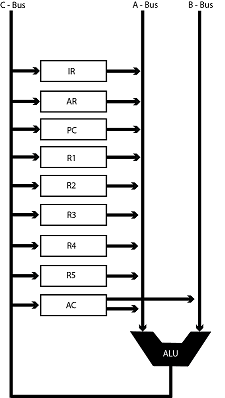
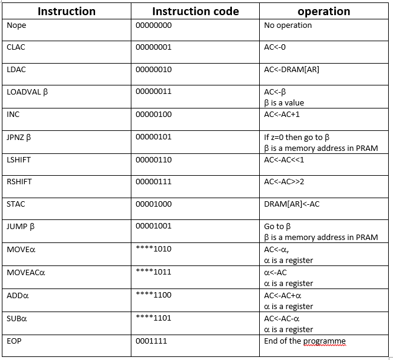
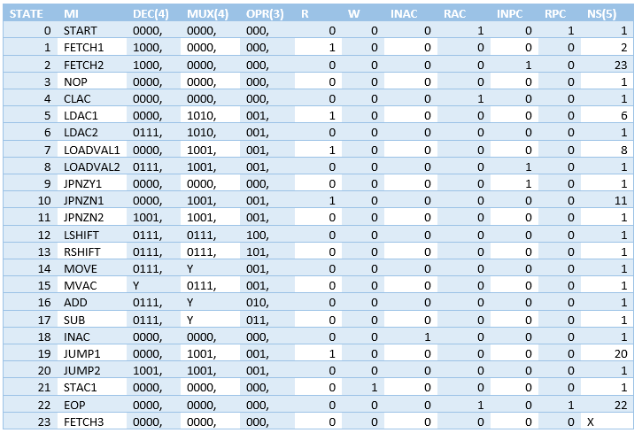
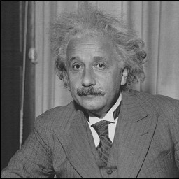

# FPGA Based Processor Design
Processor that can down-sampling an image
## Introduction

A simplified architecture of a CPU is illustrated above. Central processing unit is the
electronic circuitry that performs the instructions of a computer program by performing the
basic control, arithmetic, logical and input/output (I/O) operations by the instructions. A
microprocessor is a computer processor which incorporates the functions of a computer’s
central processing unit (CPU) on a single integrated circuit (IC), or at most a few
integrated circuits. The microprocessor is a multipurpose. It is driven by a stores data
in registers. Digital input data is fed in the form of binary and processed according to
the given instructions; results in the output. These microprocessors comprises of both
sequential digital logic and combinational logic. All instructions (numbers and symbols)
are converted into binary system in this microprocessors. Microprocessors are vital in
the modern day electronic devices. Therefore is it of huge importance to design and
implement a successful processor. In this project we are to design such processor which
can down sample a given image. High accuracy and speed is the main concern in the
implementation.
 
This project contains a design microprocessor to down sample a given 256x256 pixel image by the factor of 2. And then send
image to the processor down sample it and then send it back to the
computer to display the results obtained.

 
The process is sub divided as follows.

1. Receive input data and store in the RAM
2. Filter the image
3. Down-sample
4. Display results

## Methodology

1. Designing the algorithm

2. Simulating the algorithm in MATLAB/Python
3. Determining the Processor Specifications according to the algorithm (Number of
Registers, Memory Requirements, Bus Sizes etc)
4. Designing the ISA (What are the instruction building blocks?, What are the micro
instructions?, Instruction ROM Allocations, Data-Path, Control LUT etc)
5. Translating the algorithm in to a assembly code using the instructions defined in
the above step
6. Testing and Verifying the algorithm using a virtual processor in MATLAB/Python
7. Implement the modules in Verilog
8. Implement the design on hardware
9. Test and verify the results

## Data path of the processor

## Instruction Set of the Processor

This instruction set architecture was designed to satisfy the requirement of dawn sampling an image. Here we choose 256x256 pixel black and white image which requires 65536 memory locations to store and simple operations to dawn sample it. The basic components of this structure are,

- DRAM – 8 bit data memory with 65536 memory locations.
-	PRAM – 8 bit programme memory with 256 memory locations to store the assembly code in instruction code format.
-	AC – 16 bit accumulator. 
-	PC – 16 bit programme counter which keeps the address of the instruction in PRAM which is to executed next.
-	AR – 16 bit address register which gives address to read or write in DRAM.
-	IR – 16 bit instruction register which keeps the instruction code loaded from PRAM.
-	R1, R2, R3, R4, R5 – five 16 bit general purpose registers.
-	ALU – Arithmetic and logic unit which do the logical operations.
-	Control unit – All the signal controlling and core process done by the control unit.
-	A, B and C buses – 16 bit buses which are input and output to the ALU.

## The Arithmetic and Logic Unit

## Input Image

## Output Image

